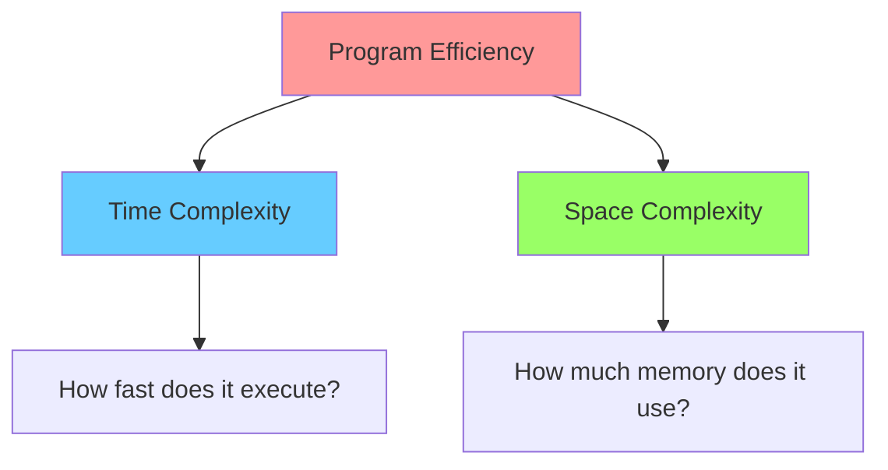
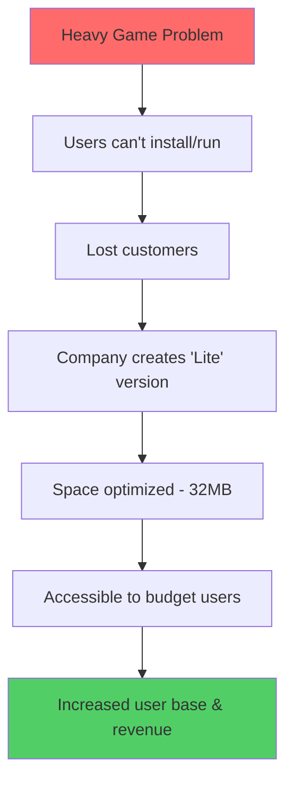

# Algorithmic Complexity - Detailed Course Notes 📊⚡

## Course Introduction & Context 🎯

**Topic**: Algorithmic Complexity Analysis  
**Duration**: Theory + 18 Practice Problems  
**Instructor**: Nitish  
**Class Focus**: Understanding how to measure algorithm efficiency

---

## 🏢 **Industry Reality vs College Environment**

### College vs Industry Mindset

| **College Approach** | **Industry Reality** |
|---------------------|---------------------|
| ✅ Code runs = Full marks | ⚡ Code must be **efficient** |
| 🎯 Focus on correctness only | 📊 Focus on **performance optimization** |
| 📝 Assignment completion | 💰 **Business impact** considerations |

> **Key Insight**: In industry, writing code that "just works" is not enough. **Efficiency is paramount** and directly impacts business success.

---

## 📏 **Understanding Efficiency in Programming**

### 🔄 **Analogy-Based Learning**

#### 🏍️ **Motorcycle Efficiency**
- **Measurement**: Mileage (distance per unit fuel)
- **Better Bike**: Travels more distance with same fuel

#### ❄️ **Air Conditioner Efficiency** 
- **Measurement**: Power rating (1-5 stars)
- **Better AC**: Uses less electricity for same cooling

#### 💻 **Program Efficiency**
- **Measurement**: Time & Space consumption
- **Better Program**: Solves same problem faster + uses less memory

### 🎯 **Two Fundamental Metrics**



> **Golden Rule**: Always consider both **TIME** and **SPACE** when writing any program

---

## 🌐 **Real-World Example 1: Google Search (Time Efficiency)**

### 🔍 **Google's Search Process**

| Step | Process | Scale | Time |
|------|---------|-------|------|
| 1️⃣ | **Search Query**: "Kolkata" | User input | Instant |
| 2️⃣ | **Web Crawling**: Search across all web pages | Crores of pages | 0.65 seconds |
| 3️⃣ | **Keyword Matching**: Find pages containing "Kolkata" | Millions of matches | 0.65 seconds |
| 4️⃣ | **Ranking Algorithm**: Sort by relevance | Complex PageRank | 0.65 seconds |
| 5️⃣ | **Result Display**: Show ranked results | Top results | 0.65 seconds |

### 🏆 **Google's Monopoly Secret**


#### 🏢 **Market Comparison**
- **E-commerce**: Flipkart vs Amazon (Competition exists)
- **Food Delivery**: Swiggy vs Zomato (Competition exists)  
- **Cab Booking**: Ola vs Uber (Competition exists)
- **Search Engine**: **Google (Monopoly)** 🎯

> **Why Google Dominates**: Their algorithm is **so time-efficient** that no competitor can match their speed

### 💰 **Business Impact**
- Without time-efficient code: **Google would never have become Google**
- **Crores of rupees** in potential losses if search was slow
- Time efficiency = **Competitive advantage** = **Market leadership**

---

## 📱 **Real-World Example 2: Space Efficiency**

### 🎮 **Personal Experience: Mobile Gaming (2015)**

#### 📱 **Device Specifications**
- **Phone**: Samsung (Budget model)
- **RAM**: 2GB
- **Storage**: 16GB
- **Problem**: Couldn't run heavy games

#### 🎯 **Asphalt Game Series**

| Version | Size | Performance | Accessibility |
|---------|------|-------------|---------------|
| **Asphalt 8** | 1.5GB → 3-4GB installed | High graphics, smooth | ❌ Only high-end devices |
| **Asphalt Lite** | 32MB | Optimized graphics | ✅ Budget devices |

### 🔄 **Space Optimization Strategy**



#### 📈 **Market Impact**
- **Facebook Lite**, **Instagram Lite**, etc.
- **Strategy**: Space optimization → Wider accessibility → More users → Higher revenue

---

## 💰 **Real-World Example 3: Facebook CSS Optimization**

### 🌐 **Web Development Context**

#### 📄 **CSS File Basics**
- **Purpose**: Website styling (colors, buttons, layout, design)
- **Process**: When you visit a website → CSS files download → Styling applied
- **Current Size**: Facebook's CSS = 20KB

### 💼 **Hiring Scenario Analysis**

| Candidate | Optimization | Package Demand | Cost Analysis |
|-----------|-------------|----------------|---------------|
| **Candidate A** | 20KB → 19KB (1KB reduction) | ₹10 Lakh | Lower optimization, lower cost |
| **Candidate B** | 20KB → 18KB (2KB reduction) | ₹30 Lakh | Higher optimization, higher cost |

**Question**: Should Facebook pay ₹20 Lakh extra for 1KB additional savings?

### 📊 **Business Mathematics**

#### 📈 **Facebook's Scale**
- **Daily Active Users**: 1.95 Billion (195 crores)
- **Daily CSS Downloads**: 195 crores × daily visits

#### 💵 **Cost Calculation**

```
1KB savings per user = 1KB × 195 crores users
Annual impact = Daily savings × 365 days
Server cost savings = ₹10 per GB (AWS approximate)

Mathematical Impact:
195 crores × 365 days × ₹10 = ₹73,00,00,000 annually
```

### 💡 **Key Insight**

| Investment | Annual Savings | ROI |
|------------|----------------|-----|
| ₹20 Lakh extra salary | ₹73 Crore annual savings | **3,650% ROI** |

> **Conclusion**: Even 1KB optimization can save **crores of rupees** when operating at scale

---

## 🎯 **Key Takeaways & Learning Objectives**

### 🔑 **Fundamental Principles**

1. **Scale Amplifies Everything**: Small optimizations → Massive impact at enterprise scale
2. **Time & Space Trade-offs**: Always consider both dimensions
3. **Business Impact**: Your code quality directly affects company profits
4. **Competitive Advantage**: Efficiency can create market monopolies

### 📚 **Today's Class Structure**


### 🎓 **Professional Development**

> **Essential Knowledge**: Every software programmer must understand:
> - How efficient is my code?
> - How much am I saving/costing the company?
> - What's my true value as a developer?

---

## ⚠️ **Critical Industry Reality**

### 💼 **Modern Software Developer Requirements**

| **Must Have** | **Impact** |
|---------------|------------|
| ✅ DSA Knowledge | Understanding algorithm efficiency |
| ✅ Complexity Analysis | Measuring code performance |
| ✅ Optimization Skills | Saving company resources |
| ❌ Without these skills | **Unknown professional worth** |

### 🏆 **Success Formula**

```
Efficient Code = Company Savings = Career Growth = Higher Packages
Inefficient Code = Company Losses = Career Stagnation = Limited Growth
```

---

## 🔮 **What's Next?**

After this introduction, the class will cover:
1. **Theoretical Concepts**: How to measure algorithmic complexity
2. **Practical Application**: 18 carefully selected practice problems
3. **Skill Development**: Improve problem-solving abilities
4. **Industry Preparation**: Real-world efficiency analysis

> **Motivation**: This is the **most fundamental aspect** of the highest-paying industry today. Mastering this topic is essential for software engineering success.

---

*📝 This foundation will enable you to write code that not only works but also contributes positively to business outcomes and establishes your value as a professional developer.*
