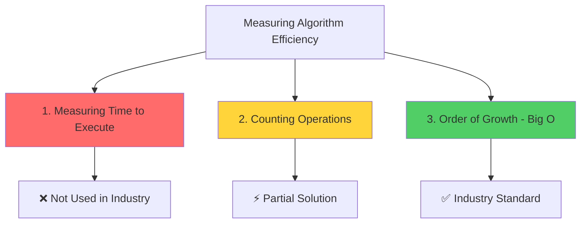
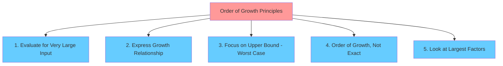
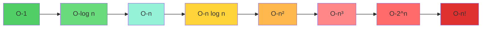

# How to calculate order of growth
# How to Calculate Order of Growth - Comprehensive Notes 📊⚡

## Course Focus & Objectives 🎯

**Today's Session**: Time Complexity Analysis (Space complexity covered in later classes)
**Goal**: Learn to measure time efficiency of algorithms  
**Practice**: 18 carefully selected problems for skill enhancement

---

## 🔧 **Three Techniques for Measuring Time Efficiency**



---

## ⏱️ **Technique 1: Measuring Time to Execute**

### 📝 **Implementation Example**

```python
import time

# Simple program: Print 1 to 100
start = time.time()
for i in range(1, 101):
    print(i)
end = time.time()
print(f"Execution time: {end - start} seconds")
```

**Result**: 0.55 seconds

### ❌ **Problems with This Approach**

| Problem | Description | Impact |
|---------|-------------|--------|
| 🖥️ **Hardware Dependency** | Different machines = Different times | No standardization |
| 🔄 **Implementation Variance** | Minor code changes affect results | Inconsistent measurements |
| 📊 **No Relationship** | Can't establish Time-Input relationship | Limited scalability analysis |
| 📏 **Small Input Issues** | Very small inputs give negligible times | Can't distinguish algorithms |

### 🔍 **Detailed Problem Analysis**

#### 🖥️ **Hardware Dependency Example**
```python
# Same code on different machines:
# Machine A (Powerful): 0.3 seconds
# Machine B (Average): 0.55 seconds  
# Machine C (Slow): 1.2 seconds
```

#### 🔄 **Implementation Variance Example**
```python
# For loop version
for i in range(1, 101):
    print(i)

# While loop version  
i = 1
while i <= 100:
    print(i)
    i += 1
```
**Same logic, different execution times!**

---

## 🔢 **Technique 2: Counting Operations**

### 📋 **Core Concept**
Count the number of operations executed as a function of input size, assuming each operation takes constant time.

### 🎯 **Operations Considered Constant Time**
- Mathematical operations (+, -, *, /, %)
- Comparisons (==, !=, <, >, <=, >=)
- Assignments (=)
- Accessing objects in memory

### 📚 **Example 1: Celsius to Fahrenheit**

```python
def c_to_f(c):
    return c * 9.0/5 + 32  # 3 operations: *, /, +
```

**Operation Count**: 3 operations (constant)

### 📚 **Example 2: Sum Function**

```python
def mysum(x):
    total = 0           # 1 operation
    for i in range(x+1): # Loop runs x times
        total += i      # 2 operations per iteration
    return total        # 1 operation (not counted in main analysis)
```

**Operation Count**: `1 + 3x` operations

### ✅ **Problems Solved by This Approach**

| Problem | Solution |
|---------|----------|
| ✅ **Hardware Independence** | Same operation count across machines |
| ✅ **Mathematical Relationship** | `T = 1 + 3x` (Time vs Input relationship) |
| ❌ **Implementation Sensitivity** | Still varies with coding style |
| ❌ **Precision Issues** | Which operations to count? |

---

## 📈 **Algorithm Analysis Framework**

### 🎯 **What We Want to Evaluate**

1. **Algorithm Performance**: How efficient is the algorithm?
2. **Scalability**: Performance with very large inputs
3. **Input Size Relationship**: Mathematical relationship between time and input size

### 📊 **Best, Average, and Worst Case Analysis**

#### 🔍 **Example: Searching in an Array**

```python
def search_for_element(L, e):
    for i in L:
        if i == e:
            return True
    return False
```

| Case | Scenario | Performance |
|------|----------|------------|
| 🟢 **Best Case** | Element is first in list | O(1) |
| 🟡 **Average Case** | Element in middle of list | O(n/2) |
| 🔴 **Worst Case** | Element not in list or at end | O(n) |

> **Industry Focus**: Always design for **worst-case scenario** to ensure consistent performance guarantees.

---

## 🚀 **Technique 3: Order of Growth (Big O Notation)**

### 🎯 **Five Key Principles**



#### 📋 **Detailed Principles**

1. **Evaluate for Very Large Input**: Focus on scalability with massive data
2. **Express Growth Relationship**: Mathematical relationship between time and input
3. **Upper Bound (Worst Case)**: Plan for the worst-case scenario
4. **Order, Not Exact**: Don't need precise formula, just growth type
5. **Largest Factors**: Focus on most time-consuming operations

### 🔤 **Big O Notation**

**Notation**: `O(n)` - "Order of n"
**Purpose**: Describes upper bound on asymptotic growth

### 📊 **Big O Calculation Process**

#### 🧮 **Step-by-Step Method**

1. **Count Operations**: Calculate total operations as function of input
2. **Remove Constants**: Drop additive constants
3. **Remove Coefficients**: Drop multiplicative constants  
4. **Keep Highest Order**: Focus on fastest-growing term

#### 📚 **Example: Factorial Function**

```python
def fact_iter(n):
    answer = 1              # 1 operation
    while n > 1:            # Loop runs n times
        answer *= n         # 1 operation per iteration
        n -= 1              # 1 operation per iteration  
    return answer
```

**Calculation**:
```
Total Operations = 1 + 5n
Step 1: Remove constant (1) → 5n  
Step 2: Remove coefficient (5) → n
Result: O(n) - Linear time complexity
```

### 📈 **Common Time Complexities**

| Expression | Big O Notation | Growth Type | Example |
|------------|----------------|-------------|---------|
| `5` | `O(1)` | Constant | Array access |
| `3n + 2` | `O(n)` | Linear | Single loop |
| `n² + 2n + 1` | `O(n²)` | Quadratic | Nested loops |
| `log n + n` | `O(n)` | Linear | n dominates log n |
| `n log n + n` | `O(n log n)` | Linearithmic | Efficient sorting |
| `3^n + n²` | `O(3^n)` | Exponential | 3^n dominates n² |

### 🎯 **Practice Problems**

#### 📚 **Problem 1**
```
Expression: n² + 2n + 2
Step 1: Remove constants → n² + 2n
Step 2: Remove coefficients → n² + n  
Step 3: Keep highest order → n²
Answer: O(n²)
```

#### 📚 **Problem 2**
```
Expression: log n + n
Analysis: For large n, n > log n
Answer: O(n)
```

#### 📚 **Problem 3**
```
Expression: n log n + n  
Analysis: For large n, n log n > n
Answer: O(n log n)
```

#### 📚 **Problem 4**
```
Expression: 3^n + n² + 30
Analysis: For large n, 3^n >> n² >> 30
Answer: O(3^n)
```

---

## 📊 **Growth Rate Comparison**

### 📈 **From Fastest to Slowest Growth**



| Growth Rate | Name | Performance | Example Algorithms |
|-------------|------|-------------|-------------------|
| `O(1)` | Constant | ⭐⭐⭐⭐⭐ Excellent | Array access, hash lookup |
| `O(log n)` | Logarithmic | ⭐⭐⭐⭐ Very Good | Binary search |
| `O(n)` | Linear | ⭐⭐⭐ Good | Linear search, simple loops |
| `O(n log n)` | Linearithmic | ⭐⭐ Fair | Merge sort, heap sort |
| `O(n²)` | Quadratic | ⭐ Poor | Bubble sort, nested loops |
| `O(2^n)` | Exponential | ❌ Very Poor | Brute force solutions |
| `O(n!)` | Factorial | ❌ Terrible | Traveling salesman (brute force) |

---

## 🔑 **Key Takeaways & Best Practices**

### ✅ **Remember**

1. **Industry Standard**: Use Big O notation for algorithm analysis
2. **Worst Case Focus**: Always design for worst-case scenarios  
3. **Scalability Matters**: Consider performance with very large inputs
4. **Simplification Rules**: Remove constants and coefficients, keep highest order term
5. **Growth Relationships**: Understand how different complexities scale

### 🎯 **Practical Application**

- **When choosing algorithms**: Prefer lower time complexity
- **When designing systems**: Consider scalability requirements
- **When optimizing code**: Focus on reducing highest-order terms
- **When comparing solutions**: Use Big O for objective comparison

### 🚀 **Next Steps**

After mastering order of growth calculation:
1. **Practice**: Solve the 18 problems provided in class
2. **Apply**: Analyze your own code for time complexity
3. **Optimize**: Identify and improve inefficient algorithms
4. **Design**: Create algorithms with better time complexity

---

*📚 This foundation in algorithmic complexity analysis is essential for writing efficient code that scales well in production environments and technical interviews.*

