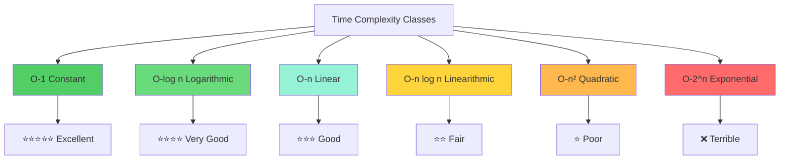
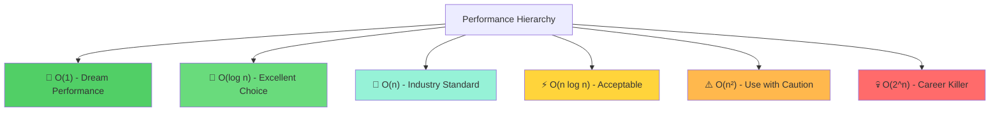

# Complexity Classes - Complete Study Guide 📊⚡

## Overview of Time Complexity Classes 🎯

**Core Principle**: Every algorithm's time complexity falls into one of **six main categories**. Understanding these classes is crucial for writing efficient code and earning higher salaries in the software industry.

---

## 🏆 **The Six Fundamental Complexity Classes**



---

## 📈 **Graph Analysis Framework**

### 📊 **Understanding the Graphs**
- **X-axis**: Input size (n)
- **Y-axis**: Time taken by the program
- **Key Insight**: Graph shape determines algorithm scalability

---

## 🥇 **1. Constant Time - O(1)**

### 📋 **Characteristics**
- **Performance**: ⭐⭐⭐⭐⭐ Excellent
- **Behavior**: Time does **NOT depend** on input size
- **Graph**: Horizontal line (flat)

### 🔍 **Real-World Example: Array Access**

```python
# Array with 100 items
arr = [10, 20, 30, 40, 50, 60, 70, 80, 90, 100]
result = arr[5]  # Gets 60, takes constant time

# Array with 200,000 items  
large_arr = [1, 2, 3, ..., 200000]
result = arr[5]  # Still gets 6th element, SAME time!
```

### 🧠 **Why is Array Access O(1)?**

```mermaid
graph LR
    A[Memory Layout] --> B[Continuous Memory Addresses]
    B --> C[1000: arr[0]]
    C --> D[1004: arr[1]]
    D --> E[1008: arr[2]]
    E --> F[1012: arr[3]]
    
    G[Access Formula] --> H[address = base_address + index × size]
    H --> I[Pure arithmetic operation]
    I --> J[No dependency on array length]
```

**Mathematical Formula**: `address = base_address + (index × 4)`
- **Result**: Direct memory access, no iteration needed
- **Time**: Independent of array size

### 💡 **Other O(1) Operations**
- Hash table lookup (average case)
- Stack push/pop
- Basic arithmetic operations
- Variable assignment

---

## 🚀 **2. Linear Time - O(n)**

### 📋 **Characteristics**
- **Performance**: ⭐⭐⭐ Good  
- **Behavior**: Time grows proportionally with input
- **Graph**: Straight diagonal line
- **Scaling**: Input doubles → Time doubles

### 🔍 **Classic Example: Linear Search**

```python
def linear_search(arr, target):
    for i in range(len(arr)):  # Checks each element
        if arr[i] == target:   # Until target found
            return i
    return -1

# Performance Analysis:
# Array size 100 → Max 100 comparisons
# Array size 1000 → Max 1000 comparisons  
# Array size 10000 → Max 10000 comparisons
```

### 📊 **Scaling Behavior**

| Input Size | Max Operations | Time Ratio |
|------------|----------------|------------|
| 100 | 100 | 1x |
| 1,000 | 1,000 | 10x |
| 10,000 | 10,000 | 100x |
| 100,000 | 100,000 | 1000x |

### ✅ **Industry Perspective**
- **Status**: Highly respected in software industry
- **Reason**: Predictable, scalable performance
- **Use Cases**: File processing, data validation, simple algorithms

---

## ⚠️ **3. Quadratic Time - O(n²)**

### 📋 **Characteristics**
- **Performance**: ⭐ Poor
- **Behavior**: Time grows with square of input
- **Graph**: Steep upward curve
- **Scaling**: Input doubles → Time increases 4x

### 🔍 **Common Example: Nested Loops**

```python
def bubble_sort(arr):
    n = len(arr)
    for i in range(n):         # Outer loop: n times
        for j in range(n-1):   # Inner loop: n times  
            if arr[j] > arr[j+1]:
                arr[j], arr[j+1] = arr[j+1], arr[j]
    return arr

# Performance Analysis:
# n = 10 → 100 operations
# n = 100 → 10,000 operations  
# n = 1000 → 1,000,000 operations
```

### 📊 **Dramatic Scaling Impact**

| Input Size | Operations | Performance Impact |
|------------|------------|-------------------|
| 10 | 100 | Acceptable |
| 100 | 10,000 | Noticeable delay |
| 1,000 | 1,000,000 | Significant lag |
| 10,000 | 100,000,000 | Nearly unusable |

### 🚨 **When to Avoid**
- Large datasets
- Real-time applications  
- Performance-critical systems

---

## 🎯 **4. Logarithmic Time - O(log n)**

### 📋 **Characteristics**
- **Performance**: ⭐⭐⭐⭐ Very Good
- **Behavior**: Time grows slowly as input increases
- **Graph**: Gentle upward curve that flattens
- **Scaling**: Input 10x → Time +1 unit

### 🔍 **Mathematical Behavior**

```python
# Logarithmic growth pattern:
# Input: 10 → Time: 1
# Input: 100 → Time: 2  
# Input: 1,000 → Time: 3
# Input: 10,000 → Time: 4
# Input: 100,000 → Time: 5
```

### 💡 **Classic Example: Binary Search**

```python
def binary_search(sorted_arr, target):
    left, right = 0, len(sorted_arr) - 1
    
    while left <= right:
        mid = (left + right) // 2
        if sorted_arr[mid] == target:
            return mid
        elif sorted_arr[mid] < target:
            left = mid + 1
        else:
            right = mid - 1
    return -1

# Each step eliminates half the remaining elements
# 1,000,000 elements → Max 20 steps needed!
```

### 🏆 **Industry Value**
- **Status**: Highly prized in software development
- **Reason**: Exceptional scalability
- **Career Impact**: "Writing O(log n) code = Higher salary potential"

---

## ⚡ **5. Linearithmic Time - O(n log n)**

### 📋 **Characteristics**
- **Performance**: ⭐⭐ Fair
- **Behavior**: Between linear and quadratic
- **Graph**: Curved upward, steeper than linear
- **Position**: Worse than O(n), better than O(n²)

### 🔍 **Common in Efficient Sorting**

```python
# Examples of O(n log n) algorithms:
# - Merge Sort
# - Quick Sort (average case)
# - Heap Sort

# Performance comparison:
# n = 1,000: O(n) = 1,000 vs O(n log n) = 10,000
# n = 10,000: O(n) = 10,000 vs O(n log n) = 130,000
```

### 📊 **Performance Analysis**

| Algorithm Type | Input 1,000 | Input 10,000 | Input 100,000 |
|----------------|-------------|---------------|----------------|
| O(n) | 1,000 | 10,000 | 100,000 |
| O(n log n) | ~10,000 | ~130,000 | ~1,600,000 |
| O(n²) | 1,000,000 | 100,000,000 | 10,000,000,000 |

---

## 💀 **6. Exponential Time - O(2^n)**

### 📋 **Characteristics**
- **Performance**: ❌ Terrible
- **Behavior**: Catastrophic growth
- **Graph**: Nearly vertical line
- **Warning**: **AVOID AT ALL COSTS**

### 🚨 **Dramatic Scaling**

```python
# Exponential growth pattern:
# Input: 10 → Operations: 1,024
# Input: 20 → Operations: 1,048,576  
# Input: 30 → Operations: 1,073,741,824
# Input: 40 → Operations: 1,099,511,627,776
```

### 😱 **Real Example: Naive Fibonacci**

```python
def fibonacci_bad(n):
    if n <= 1:
        return n
    return fibonacci_bad(n-1) + fibonacci_bad(n-2)

# This creates exponential time complexity!
# fibonacci_bad(40) takes several seconds
# fibonacci_bad(50) takes hours!
```

### ⚠️ **Career Warning**
- **Impact**: Writing exponential code can crash systems
- **Business Cost**: Can cost companies millions
- **Career Advice**: Always optimize exponential algorithms

---

## 📊 **Comparative Performance Chart**

### 🎯 **Input Size Scaling Analysis**

| Input Size | O(1) | O(log n) | O(n) | O(n log n) | O(n²) | O(2^n) |
|------------|------|----------|------|------------|-------|--------|
| **10** | 1 | 1 | 10 | 10 | 100 | 1,024 |
| **100** | 1 | 2 | 100 | 200 | 10,000 | 10³⁰ |
| **1,000** | 1 | 3 | 1,000 | 3,000 | 1,000,000 | Incalculable |
| **10,000** | 1 | 4 | 10,000 | 40,000 | 100,000,000 | Impossible |

### 📈 **Visual Performance Hierarchy**



---

## 💰 **Career and Salary Implications**

### 🎯 **The Golden Rule**

> **"The higher up the performance hierarchy, the higher your salary potential"**

### 💼 **Industry Impact**

| Complexity Class | Career Impact | Salary Potential | Industry Demand |
|------------------|---------------|------------------|-----------------|
| **O(1), O(log n)** | 🚀 Career Booster | 💰💰💰💰💰 | Extremely High |
| **O(n)** | ✅ Standard Expected | 💰💰💰💰 | High |
| **O(n log n)** | 📈 Acceptable | 💰💰💰 | Moderate |
| **O(n²)** | ⚠️ Problematic | 💰💰 | Limited |
| **O(2^n)** | 💀 Career Risk | 💰 | Avoid |

### 🏆 **Professional Development Strategy**

1. **Master O(1) and O(log n)**: Priority #1 for career growth
2. **Perfect O(n) algorithms**: Industry baseline expectation
3. **Understand O(n log n)**: Common in advanced algorithms
4. **Optimize O(n²)**: When unavoidable, minimize impact
5. **Eliminate O(2^n)**: Always find better alternatives

---

## 🔑 **Key Takeaways & Best Practices**

### ✅ **Essential Principles**

1. **Algorithm Choice Determines Career**: Choose efficient complexity classes
2. **Scalability Matters**: Consider performance with massive inputs
3. **Industry Standards**: O(n) is baseline, O(log n) is excellence
4. **Avoid Exponential**: O(2^n) can destroy systems and careers
5. **Constant Time is Gold**: O(1) operations are highly valued

### 🎯 **Practical Guidelines**

- **When designing algorithms**: Target O(log n) or O(n)
- **When reviewing code**: Identify and optimize inefficient sections
- **When interviewing**: Demonstrate understanding of complexity classes
- **When building systems**: Plan for worst-case scenarios

### 🚀 **Memory Hook**

> **"Constant → Logarithmic → Linear → Linearithmic → Quadratic → Exponential"**
> 
> **"Money ← ← ← Performance Direction → → → Poverty"**


---

*📚 Mastering complexity classes is fundamental to becoming a high-performing software engineer. The better your algorithms, the higher your value in the industry.*
