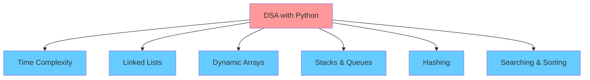
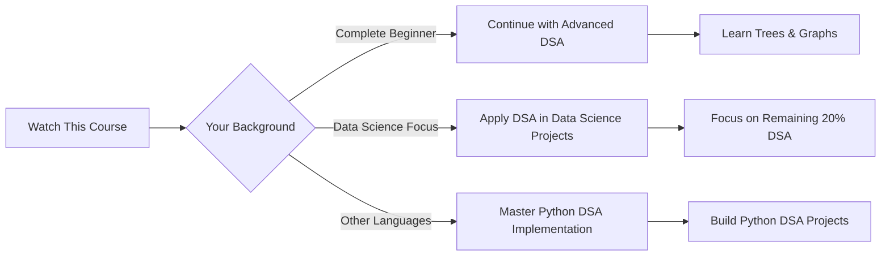

# Data Structures & Algorithms with Python - Course Notes 📊🐍

## Course Overview 🎯

This is a comprehensive 12-hour session on Data Structures and Algorithms using Python, delivered by **Nitish**. The content has been carefully edited and trimmed from an actual college course session.

---

## Course Analysis 📋

### ✅ **Good Points (Strengths)**

| Feature | Description | Benefit |
|---------|-------------|---------|
| 📚 **Detailed Coverage** | All topics covered in extensive detail with theoretical aspects | Deep understanding of DSA concepts |
| 🖼️ **Visual Learning** | Frequent use of whiteboards and drawing boards | Better concept visualization |
| 🔰 **Beginner-Friendly** | No assumptions made; everything explained from scratch | Accessible to complete beginners |
| 💻 **Code Implementation** | Not just theory - includes practical coding demonstrations | Hands-on learning experience |
| 🏗️ **Build from Scratch** | Learn to create Python data types (lists, sets, dictionaries) from scratch | Understanding internal implementations |
| ❓ **Practice Questions** | Includes both coding questions and MCQ-based questions | Enhanced learning and assessment |

### ❌ **Limitations (Bad Points)**

| Limitation | Impact | Mitigation Plan |
|------------|--------|-----------------|
| 🚫 **Incomplete Coverage** | Entire DSA curriculum not covered in 12 hours | Planned follow-up content |
| 🌳 **Missing Topics** | Trees and Graphs not included | Future video series planned |
| ⚙️ **Limited Algorithms** | Some algorithmic techniques not covered | Gradual addition throughout 2023 |

---

## 📚 **Topics Covered**

### ✅ **Included Topics**
- ⏱️ **Time Complexity Analysis**
- 🔗 **Linked Lists**
- 📊 **Dynamic Arrays**
- 📚 **Stacks and Queues**
- #️⃣ **Hashing**
- 🔍 **Searching Algorithms**
- 🔄 **Sorting Algorithms**

### ❌ **Topics Not Covered**
- 🌳 Trees
- 🕸️ Graphs
- 🔧 Advanced Algorithmic Techniques

---

## 🎯 **Target Audience**

### 👥 **Who Should Watch This Video?**

| Audience Type | Benefit Level | Recommendation |
|---------------|---------------|----------------|
| 🔰 **Complete Beginners** | ⭐⭐⭐⭐⭐ | Excellent starting point for DSA journey |
| 📊 **Data Science Aspirants** | ⭐⭐⭐⭐ | Covers 80% of DSA needed for Data Science |
| 🔄 **Multi-language Programmers** | ⭐⭐⭐⭐ | Great resource for Python-specific DSA implementation |

### 📈 **Learning Path Recommendations**

---

## 🎓 **Course Structure & Approach**

### 📖 **Teaching Methodology**
- 🖼️ **Visual Learning**: Extensive use of whiteboards and diagrams
- 💡 **Theory + Practice**: Balanced approach between concepts and implementation
- 🔨 **Build from Scratch**: Understanding internal workings of data structures
- 🧠 **No Assumptions**: Everything explained from the ground up

### 🏆 **Unique Selling Points**
1. **Python-Focused**: Specifically designed for Python programmers
2. **Comprehensive Theory**: Deep dive into theoretical aspects
3. **Practical Implementation**: Learn to build data structures from scratch
4. **Real-world Applications**: Understand how Python's built-in data types work internally

---

## 🚀 **Future Plans**

> 💡 **Note**: This is just the beginning! The instructor plans to:
> - 📂 Break down this 12-hour video into smaller, digestible playlists
> - 📅 Gradually add more topics throughout 2023
> - 🌳 Include Trees, Graphs, and advanced algorithmic techniques
> - 🔄 Create a complete DSA curriculum

---

## 📝 **Course Prerequisites**

| Skill Level | Requirement | Status |
|-------------|-------------|--------|
| 🐍 **Python Basics** | Recommended | ✅ Helpful but not mandatory |
| 💻 **Programming Experience** | Basic understanding | ✅ Course starts from scratch |
| 🧮 **Mathematical Background** | Elementary math | ✅ No advanced math required |

---

## 💬 **Engagement & Feedback**

The instructor emphasizes the importance of community feedback:

- 👍 **Like** if you find the content helpful
- 🔄 **Share** to help others discover this resource
- 📺 **Subscribe** for more DSA content
- 💬 **Comment** with feedback and suggestions

---

## 🎯 **Key Takeaways**

> 🌟 **Remember**: This course serves as an excellent foundation for Data Structures and Algorithms in Python. While it doesn't cover every topic, it provides a solid base that you can build upon with additional resources and continued learning.

### 📊 **Course Value Proposition**
- **For Beginners**: Perfect starting point with no prerequisites
- **For Data Scientists**: Covers majority of required DSA knowledge
- **For Python Developers**: Learn DSA specifically in Python context
- **For Career Growth**: Strong foundation for technical interviews and problem-solving

---

*📚 This course represents a significant investment of time and effort in content creation, editing, and presentation. The 12-hour duration reflects the comprehensive nature of the material covered.*
